---
## Front matter
title: "Лабораторная работа №3"
subtitle: "НКАбд-02-23"
author: "Выборнов Дмитрий Валерьевич"

## Generic otions
lang: ru-RU
toc-title: "Содержание"

## Bibliography
bibliography: bib/cite.bib
csl: pandoc/csl/gost-r-7-0-5-2008-numeric.csl

## Pdf output format
toc: false # Table of contents
toc-depth: 2
lof: false # List of figures
lot: false # List of tables
fontsize: 12pt
linestretch: 1.5
papersize: a4
documentclass: scrreprt
## I18n polyglossia
polyglossia-lang:
  name: russian
  options:
	- spelling=modern
	- babelshorthands=true
polyglossia-otherlangs:
  name: english
## I18n babel
babel-lang: russian
babel-otherlangs: english
## Fonts
mainfont: PT Serif
romanfont: PT Serif
sansfont: PT Sans
monofont: PT Mono
mainfontoptions: Ligatures=TeX
romanfontoptions: Ligatures=TeX
sansfontoptions: Ligatures=TeX,Scale=MatchLowercase
monofontoptions: Scale=MatchLowercase,Scale=0.9
## Biblatex
biblatex: true
biblio-style: "gost-numeric"
biblatexoptions:
  - parentracker=true
  - backend=biber
  - hyperref=auto
  - language=auto
  - autolang=other*
  - citestyle=gost-numeric
## Pandoc-crossref LaTeX customization
figureTitle: "Рис."
tableTitle: "Таблица"
listingTitle: "Листинг"
lofTitle: "Список иллюстраций"
lotTitle: "Список таблиц"
lolTitle: "Листинги"
## Misc options
indent: true
header-includes:
  - \usepackage{indentfirst}
  - \usepackage{float} # keep figures where there are in the text
  - \floatplacement{figure}{H} # keep figures where there are in the text
---

# Цель работы

Освоение процедуры оформления отчетов с помощью легковесного языка разметки Markdown.

# Задание

1. Создание файла отчёта и заполнение отчета по выполнению лабораторной работы №3 с помощью языка разметки Markdown.
2. Задания для самостоятельной работы.

# Теоретическое введение 

**Markdown** - это облегчённый язык разметки, созданный с целью обозначения форматирования в простом тексте, с максимальным сохранением его читаемости человеком, и пригодный для машинного преобразования в языки для продвинутых публикаций (HTML, Rich Text и других).

# Выполнение лабораторной работы

Перехожу в свой каталог курса.

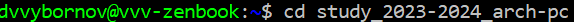{#fig:001 width=70%}

Обновляю локальный репозиторий при помощи git pull.

{#fig:002 width=70%}

Перехожу в каталог с шаблоном отчёта.

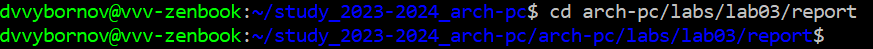{#fig:003 width=70%}

Провожу компиляцию шаблона при помощи команды make и проверяю наличие сгенерированных файлов.

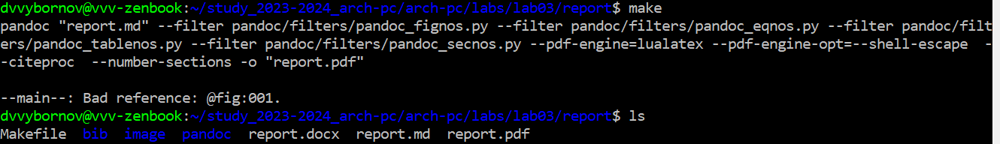{#fig:004 width=70%}

Удаляю созданные файлы при помощи make clean и проверяю, что они действительно были удалены.

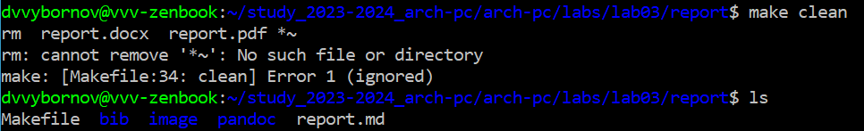{#fig:005 width=70%}

Открываю файл report.md в редакторе Nano.

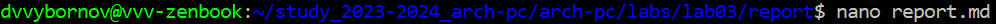{#fig:006 width=70%}

Начинаю заполнять отчёт.

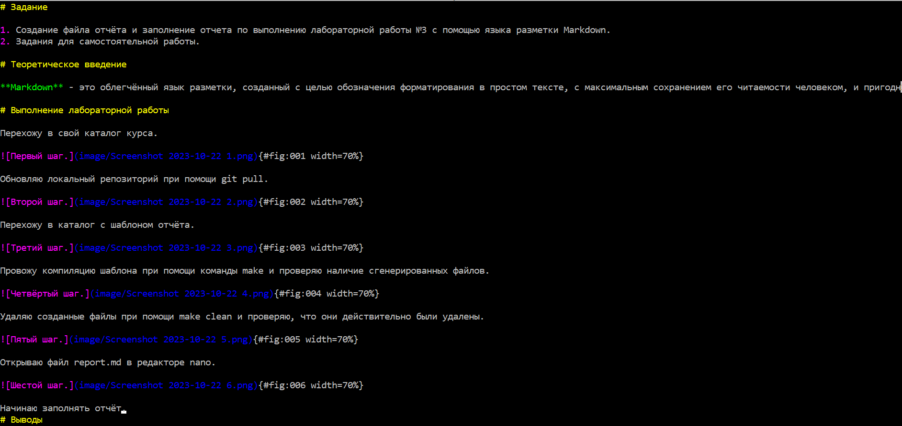{#fig:007 width=70%} 

После выполнения заданий для самостоятельной работы я скомпилирую отчёт при помощи make и загружу его на Github.

# Задания для самостоятельной работы

## №1

Перехожу в директорию lab02.

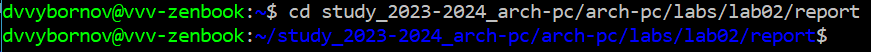{#fig:008 width=100%}

Открываю файл report.md при помощи редактора Nano.

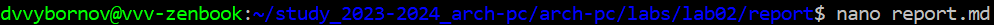{#fig:009 width=70%}

Заполняю отчёт.

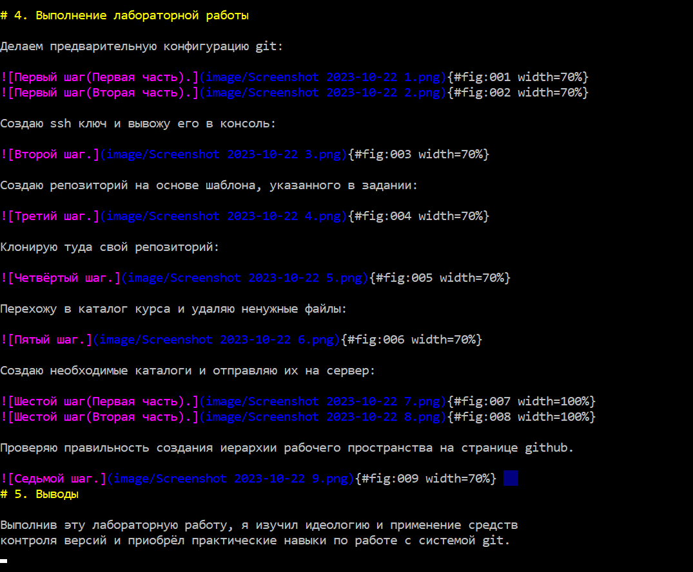{#fig:010 width=70%}

Завершив создание отчёта, я компилирую его при помощи команды make и проверяю наличие файлов report.pdf и report.ods.

{#fig:011 width=70%}

## №2

Добавляю изменения при помощи git add .

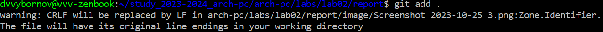{#fig:012 width=100%}

Сохраняю изменения с помощью git commit.

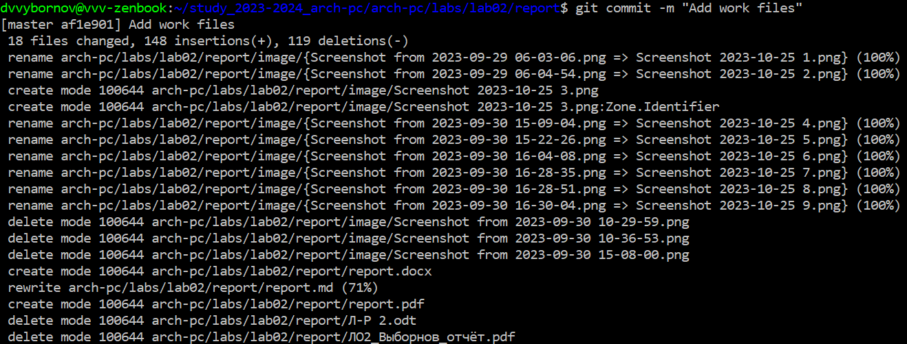{#fig:013 width=100%}

Добавляю файлы на сервер, используя git push.

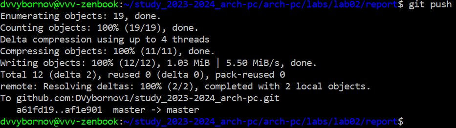{#fig:014 width=100%}

# Выводы

Выполнив эту лабораторную работу, я освоил процедуры оформления отчетов с помощью легковесного языка разметки Markdown.
