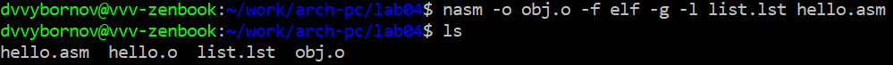

---
## Front matter
title: "Лабораторная работа №4"
subtitle: "НКАбд-02-23"
author: "Выборнов Дмитрий Валерьевич"

## Generic otions
lang: ru-RU
toc-title: "Содержание"

## Bibliography
bibliography: bib/cite.bib
csl: pandoc/csl/gost-r-7-0-5-2008-numeric.csl

## Pdf output format
toc: false # Table of contents
toc-depth: 2
lof: false # List of figures
lot: false # List of tables
fontsize: 12pt
linestretch: 1.5
papersize: a4
documentclass: scrreprt
## I18n polyglossia
polyglossia-lang:
  name: russian
  options:
	- spelling=modern
	- babelshorthands=true
polyglossia-otherlangs:
  name: english
## I18n babel
babel-lang: russian
babel-otherlangs: english
## Fonts
mainfont: PT Serif
romanfont: PT Serif
sansfont: PT Sans
monofont: PT Mono
mainfontoptions: Ligatures=TeX
romanfontoptions: Ligatures=TeX
sansfontoptions: Ligatures=TeX,Scale=MatchLowercase
monofontoptions: Scale=MatchLowercase,Scale=0.9
## Biblatex
biblatex: true
biblio-style: "gost-numeric"
biblatexoptions:
  - parentracker=true
  - backend=biber
  - hyperref=auto
  - language=auto
  - autolang=other*
  - citestyle=gost-numeric
## Pandoc-crossref LaTeX customization
figureTitle: "Рис."
tableTitle: "Таблица"
listingTitle: "Листинг"
lofTitle: "Список иллюстраций"
lotTitle: "Список таблиц"
lolTitle: "Листинги"
## Misc options
indent: true
header-includes:
  - \usepackage{indentfirst}
  - \usepackage{float} # keep figures where there are in the text
  - \floatplacement{figure}{H} # keep figures where there are in the text
---

# Цель работы

Освоение процедуры компиляции и сборки программ, написанных на ассемблере NASM.

# Задание

1. Создание программы Hello world!
2. Использование транслятора NASM.
3. Работа с расширенным синтаксисом командной строки NASM.
4. Использование компоновщика LD.
5. Запуск исполняемого файла.
6. Задания для самостоятельной работы.

# Теоретическое введение

**Язык ассемблера** (assembly language, сокращённо asm) — машинно-ориентированный
язык низкого уровня. Можно считать, что он больше любых других языков приближен к
архитектуре ЭВМ и её аппаратным возможностям, что позволяет получить к ним более
полный доступ, нежели в языках высокого уровня,таких как C/C++, Perl, Python и пр. Заметим,
что получить полный доступ к ресурсам компьютера в современных архитектурах нельзя,
самым низким уровнем работы прикладной программы является обращение напрямую к
ядру операционной системы. Именно на этом уровне и работают программы, написанные
на ассемблере. Но в отличие от языков высокого уровня ассемблерная программа содержит
только тот код, который ввёл программист. Таким образом язык ассемблера — это язык, с
помощью которого понятным для человека образом пишутся команды для процессора.
Следует отметить, что процессор понимает не команды ассемблера, а последовательности
из нулей и единиц — **машинные коды**. До появления языков ассемблера программистам
приходилось писать программы, используя только лишь машинные коды, которые были
крайне сложны для запоминания, так как представляли собой числа, записанные в двоичной
или шестнадцатеричной системе счисления. Преобразование или трансляция команд с
языка ассемблера в исполняемый машинный код осуществляется специальной программой
транслятором — **Ассемблер**.
Программы, написанные на языке ассемблера, не уступают в качестве и скорости программам, написанным на машинном языке,так как транслятор просто переводит мнемонические
обозначения команд в последовательности бит (нулей и единиц).
Используемые мнемоники обычно одинаковы для всех процессоров одной архитектуры
или семейства архитектур (среди широко известных — мнемоники процессоров и контроллеров x86, ARM, SPARC, PowerPC,M68k). Таким образом для каждой архитектуры существует
свой ассемблер и, соответственно, свой язык ассемблера.
В нашем курсе будет использоваться ассемблер NASM (Netwide Assembler).
NASM — это открытый проект ассемблера, версии которого доступны под различные
операционные системы и который позволяет получать объектные файлы для этих систем. В
NASM используется Intel-синтаксис и поддерживаются инструкции x86-64.

# Выполнение лабораторной работы

## Создание программы Hello world!

Создаю каталог для работы с программами на языке ассемблера NASM и перехожу в него:

{#fig:001 width=100%}

Создаю текстовый файл с именем hello.asm и открываю его при помощи nano:

{#fig:002 width=100%}

Ввожу в файл текст необходимой программы:

{#fig:003 width=100%}

## Использование транслятора NASM.

Ввожу команду для использования транслятора NASM и проверяю, что все нужные мне вайлы были созданы:

{#fig:004 width=100%}

## Работа с расширенным синтаксисом командной строки NASM.

Выполняю команду, которая скомпилирует файл Hello.asm в obj.o и создаст файл листинга, и проверяю, что все нужные файлы созданы:

{#fig:005 width=100%}

## Использование компоновщика LD.

Использую команду ld для создания исполняемого файла Hello и проверяю, что он был создан:

{#fig:006 width=100%}

Выполняю команду, которая создаст файл main из объектного файла obj.o:

{#fig:007 width=100%}

## Запуск исполняемого файла.

Запускаю созданный исполняемый файл:

{#fig:008 width=100%}

## Задания для самостоятельной работы

### №1

С помощью команды cp создаю копию файла hello.asm с именем lab4.asm:

{#fig:009 width=100%}

### №2

Вношу необходимые изменения в файл lab4.asm:

{#fig:010 width=100%}

### №3

Транслирую полученный текст программы в объектный файл: 

{#fig:011 width=100%}

Выполняю компоновку объектного файла и запускаю получившийся исполняемый файл:

{#fig:012 width=100%}

### №4

Копирую файлы Hello.asm и lab4.asm в нужный репозиторий: 

{#fig:013 width=100%}

Загружаю файлы на Github: 

{#fig:014 width=100%}

# Выводы

Выполнив эту лабораторную работу, я освоил процедуры компиляции и сборки программ, написанных на ассемблере NASM.
