---
## Front matter
title: "Лабораторная работа №5"
subtitle: "НКАбд-02-23"
author: "Выборнов Дмитрий Валерьевич"

## Generic otions
lang: ru-RU
toc-title: "Содержание"

## Bibliography
bibliography: bib/cite.bib
csl: pandoc/csl/gost-r-7-0-5-2008-numeric.csl

## Pdf output format
toc: false # Table of contents
toc-depth: 2
lof: false # List of figures
lot: false # List of tables
fontsize: 12pt
linestretch: 1.5
papersize: a4
documentclass: scrreprt
## I18n polyglossia
polyglossia-lang:
  name: russian
  options:
	- spelling=modern
	- babelshorthands=true
polyglossia-otherlangs:
  name: english
## I18n babel
babel-lang: russian
babel-otherlangs: english
## Fonts
mainfont: PT Serif
romanfont: PT Serif
sansfont: PT Sans
monofont: PT Mono
mainfontoptions: Ligatures=TeX
romanfontoptions: Ligatures=TeX
sansfontoptions: Ligatures=TeX,Scale=MatchLowercase
monofontoptions: Scale=MatchLowercase,Scale=0.9
## Biblatex
biblatex: true
biblio-style: "gost-numeric"
biblatexoptions:
  - parentracker=true
  - backend=biber
  - hyperref=auto
  - language=auto
  - autolang=other*
  - citestyle=gost-numeric
## Pandoc-crossref LaTeX customization
figureTitle: "Рис."
tableTitle: "Таблица"
listingTitle: "Листинг"
lofTitle: "Список иллюстраций"
lotTitle: "Список таблиц"
lolTitle: "Листинги"
## Misc options
indent: true
header-includes:
  - \usepackage{indentfirst}
  - \usepackage{float} # keep figures where there are in the text
  - \floatplacement{figure}{H} # keep figures where there are in the text
---

# Цель работы

Приобретение практических навыков работы в Midnight Commander. Освоение инструкций
языка ассемблера mov и int.

# Задание

1. Основы работы с Midnight Commander.
2. Подключение внешнего файла в NASM.
3. Задания для самостоятельной работы.

# Теоретическое введение

## Midnight Commander

Midnight Commander (или просто mc) — это программа, которая позволяет просматривать
структуру каталогов и выполнять основные операции по управлению файловой системой,
т.е. mc является файловым менеджером. Midnight Commander позволяет сделать работу с
файлами более удобной и наглядной.

## Ассемблер NASM

Программа на языке ассемблера NASM, как правило, состоит из трёх секций: секция кода
программы (SECTION .text), секция инициированных (известных во время компиляции)
данных (SECTION .data) и секция неинициализированных данных (тех, под которые во
время компиляции только отводится память, а значение присваивается в ходе выполнения
программы) (SECTION .bss).

# Выполнение лабораторной работы

## Основы работы с Midnight Commander.

Открываю mc и перехожу в нужный каталог.

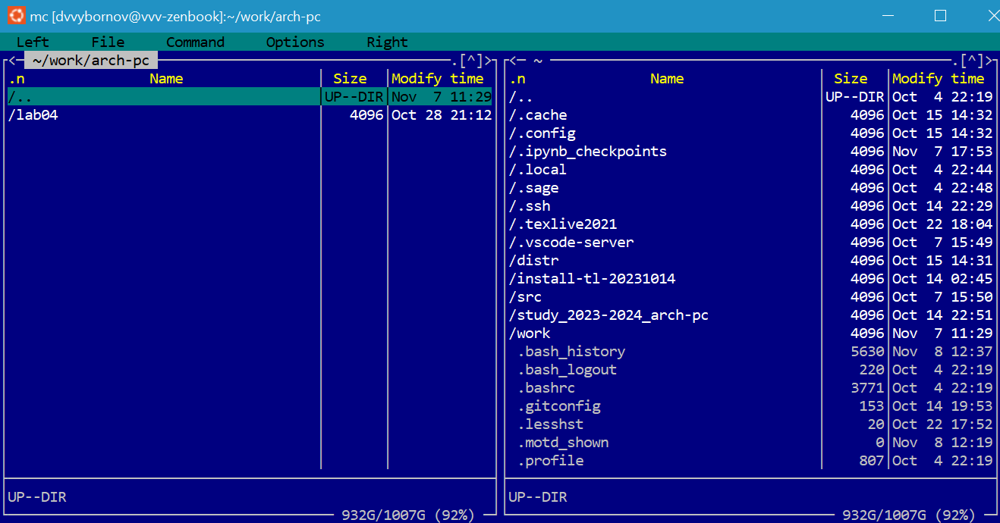{#fig:001 width=100%}

Создаю новый каталог и перехожу в него.

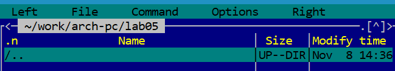{#fig:002 width=100%}

Создаю файл lab5-1.asm.

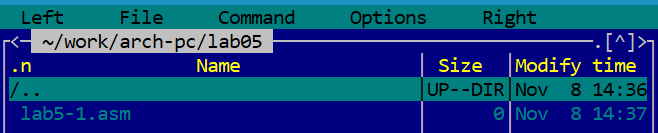{#fig:003 width=100%}

Открываю созданный мной файл и ввожу необходимый текст программы.

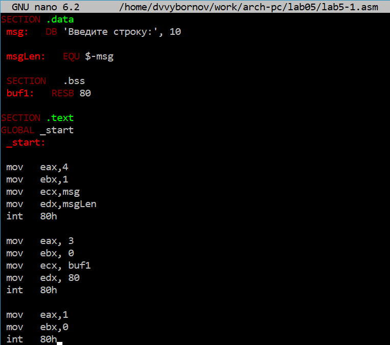{#fig:004 width=100%}

Проверяю, что изменения сохранены.

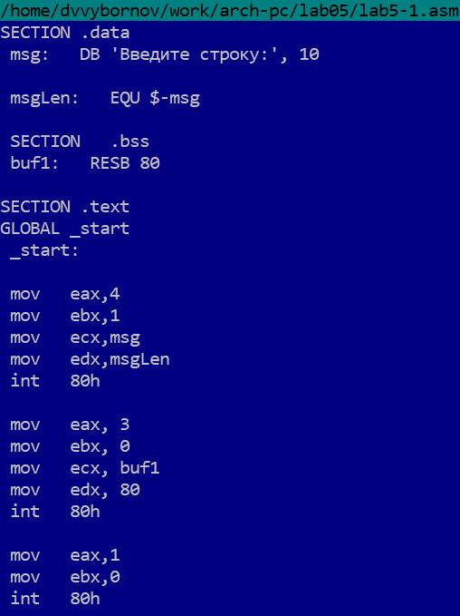{#fig:005 width=100%}

Превращаю текст программы lab5-1.asm в объектный файл, выполняю компоновку объектного файла и запускаю получившийся исполняемый файл.

{#fig:006 width=100%}

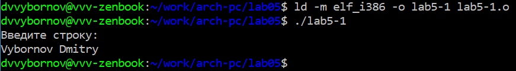{#fig:007 width=100%}

## Подключение внешнего файла в NASM.

Скачайте файл in_out.asm со страницы курса и перемещаю его в нужный каталог.

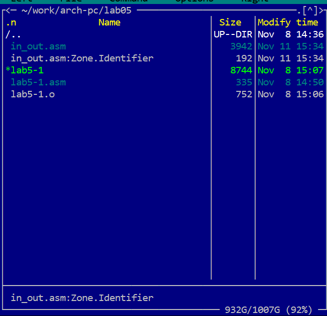{#fig:008 width=100%}

Создаю копию файла lab5-1.asm.

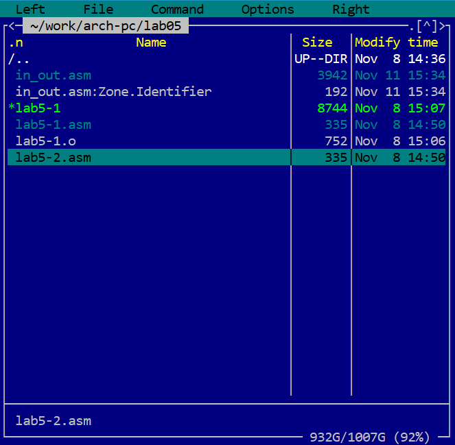{#fig:009 width=100%}

Вношу необходимые изменения в текст программы.

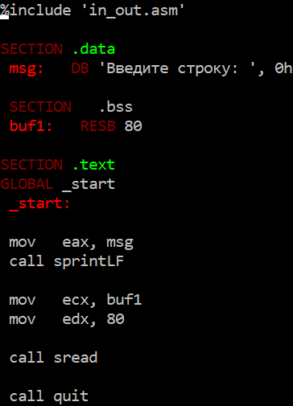{#fig:010 width=100%}

Создаю исполняемый файл и проверяю его работу.

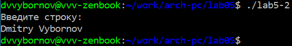{#fig:011 width=100%}

Создаю ещё одну копию файла lab5-2.asm.

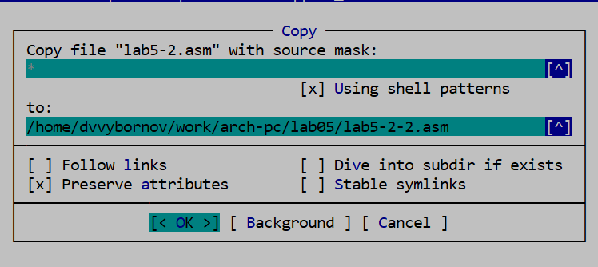{#fig:012 width=100%}

Проверяю работу программы, заменив sprintLF на sprint.

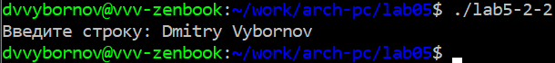{#fig:013 width=100%}

Разница между этими двумя вариантами программы в том, что, в отличии от sprint, при использовании sprintLF ввод имени пользователя начинается с новой строки.

## Задания для самостоятельной работы

1. Создаю ещё одну копию файла lab5-1.asm.

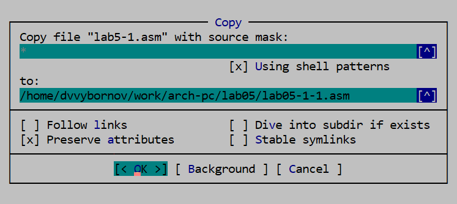{#fig:014 width=100%}

Изменяю программу так, чтобы она выводила имя пользователя.

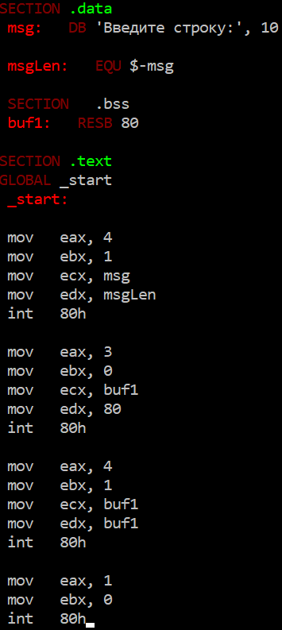{#fig:015 width=100%}

2. Получаю исполняемый файл и проверяю его работу.

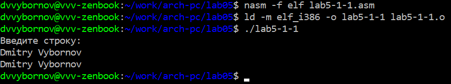{#fig:016 width=100%}

3. Создаю копию файла lab5-2.asm и изменяю текст программы так, чтобы она выводила имя пользователя.

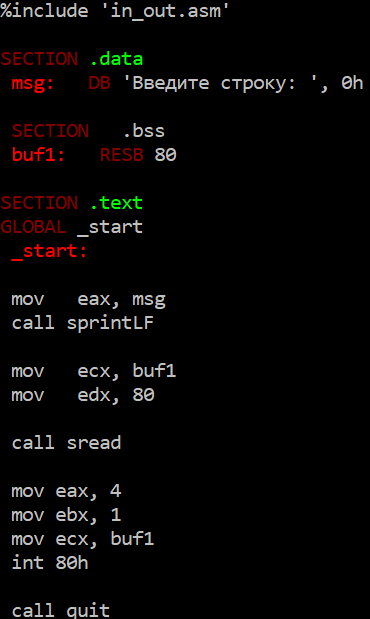{#fig:017 width=100%}

4. Создаю исполняемый файл и проверяю его работу.

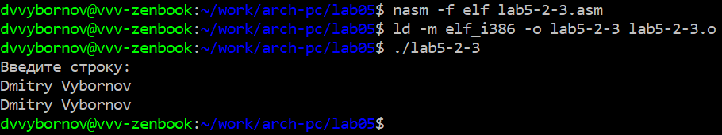{#fig:018 width=100%}

# Выводы

Выполнив эту лабораторную работу, я приобрёл практические навыки работы в Midnight Commander и освоил инструкции языка ассемблера mov и int.
