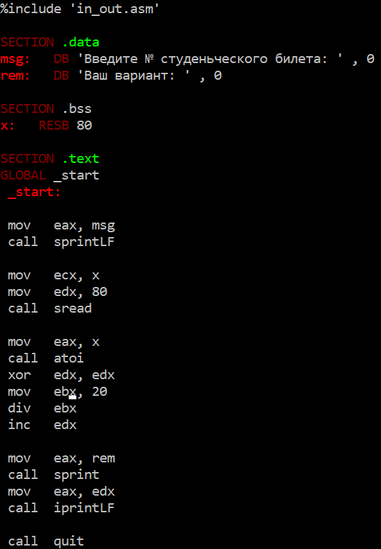

---
## Front matter
title: "Лабораторная работа №6"
subtitle: "НКАбд-02-23"
author: "Выборнов Дмитрий Валерьевич"

## Generic otions
lang: ru-RU
toc-title: "Содержание"

## Bibliography
bibliography: bib/cite.bib
csl: pandoc/csl/gost-r-7-0-5-2008-numeric.csl

## Pdf output format
toc: false # Table of contents
toc-depth: 2
lof: false # List of figures
lot: false # List of tables
fontsize: 12pt
linestretch: 1.5
papersize: a4
documentclass: scrreprt
## I18n polyglossia
polyglossia-lang:
  name: russian
  options:
	- spelling=modern
	- babelshorthands=true
polyglossia-otherlangs:
  name: english
## I18n babel
babel-lang: russian
babel-otherlangs: english
## Fonts
mainfont: PT Serif
romanfont: PT Serif
sansfont: PT Sans
monofont: PT Mono
mainfontoptions: Ligatures=TeX
romanfontoptions: Ligatures=TeX
sansfontoptions: Ligatures=TeX,Scale=MatchLowercase
monofontoptions: Scale=MatchLowercase,Scale=0.9
## Biblatex
biblatex: true
biblio-style: "gost-numeric"
biblatexoptions:
  - parentracker=true
  - backend=biber
  - hyperref=auto
  - language=auto
  - autolang=other*
  - citestyle=gost-numeric
## Pandoc-crossref LaTeX customization
figureTitle: "Рис."
tableTitle: "Таблица"
listingTitle: "Листинг"
lofTitle: "Список иллюстраций"
lotTitle: "Список таблиц"
lolTitle: "Листинги"
## Misc options
indent: true
header-includes:
  - \usepackage{indentfirst}
  - \usepackage{float} # keep figures where there are in the text
  - \floatplacement{figure}{H} # keep figures where there are in the text
---

# Цель работы

Освоение арифметических инструкций языка ассемблера **NASM**.

# Задание

1. Символьные и численные данные в NASM.
2. Выполнение арифметических операций в NASM.
3. Вопросы по программе.
4. Задание для самостоятельной работы.

# Теоретическое введение

Большинство инструкций на языке ассемблера требуют обработки операндов. Адрес операнда предоставляет место, где хранятся данные, подлежащие обработке. Это могут быть
данные хранящиеся в регистре или в ячейке памяти. Три основных способа адресации: регистровая адресация, непосревственная адресация и адресация памяти. 
В **NASM** доступны команды сложения, вычетания, умножения, деления, изменения знака, инкремента и декремента.
Ввод информации с клавиатуры и вывод её на экран осуществляется в символьном виде.
Кодирование этой информации производится согласно кодовой таблице символов ASCII.
ASCII – сокращение от American Standard Code for Information Interchange (Американский
стандартный код для обмена информацией). Согласно стандарту ASCII каждый символ
кодируется одним байтом.

# Выполнение лабораторной работы

## Символьные и численные данные в NASM.

Перехожу в каталог курса, создаю отдельный каталог для шестой лабораторной работы, перехожу в него и в нём создаю 
файл для первого задания.

{#fig:001 width=100%}

Ввожу текст программы вывода регистра eax.

{#fig:002 width=50%}

Создаю исполняемый файл и запускаю его.

{#fig:003 width=100%}

Изменяю текст программы.

{#fig:004 width=50%}

Запускаю изменённую программу.

{#fig:005 width=100%}

На экране ничего не отображается, так как 10 - это код символа перевода строки.

Создаю новый файл и ввожу в него другую версию программы вывода регистра eax.

{#fig:006 width=50%}

Создаю исполняемый файл новой версии программы и запускаю его.

{#fig:007 width=100%}

Изменяю новую версию программы аналогично предыдущей.

{#fig:008 width=50%}

Запускаю изменённую программу.

{#fig:009 width=100%}

Программа выводит 10, т. к. теперь она складывает сами числа, а не их коды.

Заменяю функцию iprintLF на iprint.

{#fig:010 width=50%}

Запускаю полученную программу.

{#fig:011 width=100%}

Вывод функции iprintLF отличается от вывода функции iprint тем, что она добавляет к выводу символ переноса строки.

## Выполнение арифметических операций в NASM.

Создаю новый файл lab6-3.asm и ввожу в него текст программы вычисления выражения.

{#fig:012 width=50%}

Создаю исполняемый файл и запускаю его.

{#fig:013 width=100%}

Изменяю текст программы для вычисления выражения F(x) = (4 * 6 + 2)/5.

{#fig:014 width=50%}

Запускаю изменённую программу.

{#fig:015 width=100%}

Создаю новый файл и ввожу в него программу для вычисления варианта задания по номеру студенческого билета.

{#fig:016 width=50%}

Создаю исполняемый файл и запускаю его.

{#fig:017 width=100%}

## Ответы на вопросы по программе.

1. За вывод на экран сообщения "Ваш вариант: " отвечают строки **mov eax, rem** и **call sprint**.
2. Инструкция **mov eax, x** используется для определения адреса записи значения вводимой строки x в регистр eax. Инструкция **mov edx, 80** используется для записи длины
 вводимой строки в регистр edx, а инструкция **call sread** - для вызова подпрограммы из внешнего файла, которая используется для ввода с клавиатуры.
3. Строка **call atoi** используется для вызова подпрограммы из внешнего файла, которая преобразует ascii - код символа в целое число.
4. За вычисления варианта отвечают строки **xor edx, edx**, **mov edx, 20**, **div ebx** и **inc edx**.
5. Остаток записывается в регистр **edx**.
6. Инструкция **inc edx** увеличивает значение регистра **edx** на 1.
7. За вывод результата вычислений отвечают строки **mov eax, edc** и **call iprintLF**.

## Задание для самостоятельной работы.

Создаю файл Expression.asm и ввожу в него текст программы для выражения №10.

{#fig:018 width=50%}

Создаю исполняемый файл, запускаю его и проверяю его работу для значений x = 2 и x = 3.

{#fig:019 width=100%}

# Выводы

Выполнив эту лабораторную работу, я освоил арифметические инструкции языка ассемблера **NASM**.
