---
## Front matter
title: "Лабораторная работа №7"
subtitle: "НКАбд-02-23"
author: "Выборнов Дмитрий Валерьевич"

## Generic otions
lang: ru-RU
toc-title: "Содержание"

## Bibliography
bibliography: bib/cite.bib
csl: pandoc/csl/gost-r-7-0-5-2008-numeric.csl

## Pdf output format
toc: false # Table of contents
toc-depth: 2
lof: false # List of figures
lot: false # List of tables
fontsize: 12pt
linestretch: 1.5
papersize: a4
documentclass: scrreprt
## I18n polyglossia
polyglossia-lang:
  name: russian
  options:
	- spelling=modern
	- babelshorthands=true
polyglossia-otherlangs:
  name: english
## I18n babel
babel-lang: russian
babel-otherlangs: english
## Fonts
mainfont: PT Serif
romanfont: PT Serif
sansfont: PT Sans
monofont: PT Mono
mainfontoptions: Ligatures=TeX
romanfontoptions: Ligatures=TeX
sansfontoptions: Ligatures=TeX,Scale=MatchLowercase
monofontoptions: Scale=MatchLowercase,Scale=0.9
## Biblatex
biblatex: true
biblio-style: "gost-numeric"
biblatexoptions:
  - parentracker=true
  - backend=biber
  - hyperref=auto
  - language=auto
  - autolang=other*
  - citestyle=gost-numeric
## Pandoc-crossref LaTeX customization
figureTitle: "Рис."
tableTitle: "Таблица"
listingTitle: "Листинг"
lofTitle: "Список иллюстраций"
lotTitle: "Список таблиц"
lolTitle: "Листинги"
## Misc options
indent: true
header-includes:
  - \usepackage{indentfirst}
  - \usepackage{float} # keep figures where there are in the text
  - \floatplacement{figure}{H} # keep figures where there are in the text
---

# Цель работы

Изучение команд условного и безусловного переходов. Приобретение навыков написания
программ с использованием переходов. Знакомство с назначением и структурой файла
листинга.

# Задание

1. Реализация переходов в **NASM**. 
2. Изучение структуры файлы листинга.
3. Задание для самостоятельной работы.

# Теоретическое введение

Для реализации ветвлений в ассемблере используются так называемые команды передачи
управления или команды перехода. Можно выделить 2 типа переходов:
• условный переход – выполнение или не выполнение перехода в определенную точку
программы в зависимости от проверки условия.
• безусловный переход – выполнение передачи управления в определенную точку программы без каких-либо условий.

# Выполнение лабораторной работы

## Реализация переходов в **NASM**.

Создаю каталог lab07 и файл lab7-1.asm.

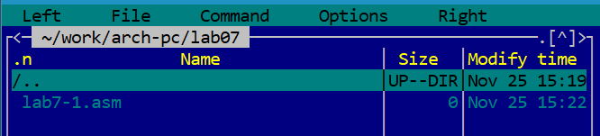{#fig:001 width=100%}

Ввожу в файл lab7-1.asm текст нужной программы.

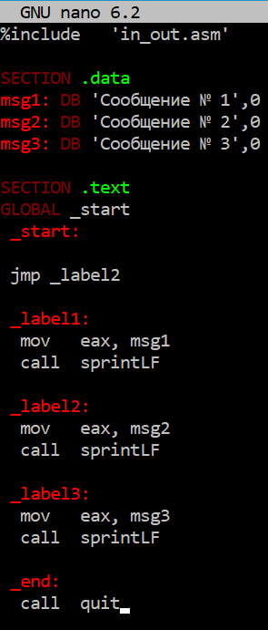{#fig:002 width=70%}

Создаю исполняемый файл и запускаю его.

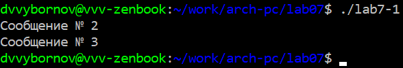{#fig:003 width=100%}

Изменяю текст программы.

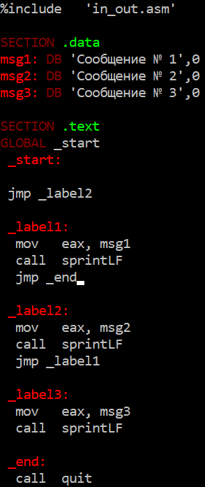{#fig:004 width=70%}

Проверяю работу изменённого файла.

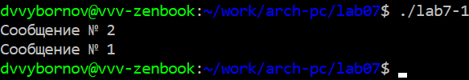{#fig:005 width=100%}

Изменяю работу файла, чтобы он выводил сообщения в обратном порядке.

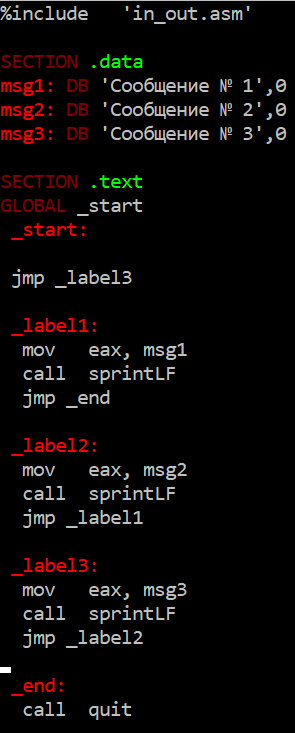{#fig:006 width=70%}

Создаю исполняемый файл и запускаю его.

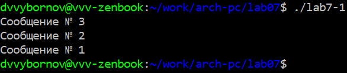{#fig:007 width=100%}

Создаю новый файл и ввожу в него текст программы, которая определяет и выводит на экран наибольшую из 3
целочисленных переменных A, B и C.

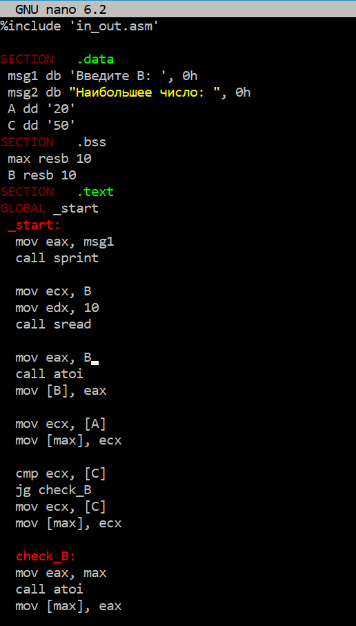{#fig:008 width=70%}

Проверяю работу программы для нескольких значений B.

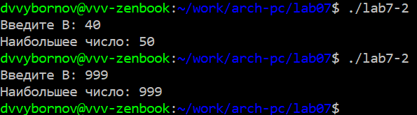{#fig:009 width=100%}

## Изучение структуры файлы листинга.

Получаю файл листинга для lab7-2.asm.

{#fig:010 width=100%}

Открывю файл листинга при помощи nano.

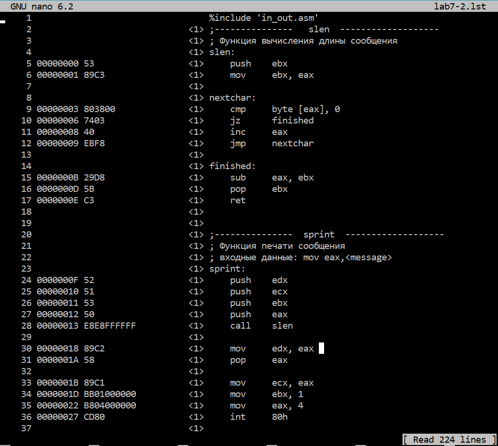{#fig:011 width=70%}

1. 15 - Номер строки "15", адрес строки "0000000B", машинный код "29D8", исходный текст программы "sub   eax, ebx" - sub уменьшает значение eax на значение ebx.
2. 2 - Пустая строка, разделяющая содержимое файлов in_out.asm и lab7-2.asm. (Технически является 172 строкой файла листинга.)
3. 19 - Номер строки "19", адрес строки "000000FC", машинный код "E842FFFFFF", исходный текст программы "call sread" - call вызывает подпрограмму sread из файла in_out.asm. (Технически является 189 строкой листинга.)

Удаляю один из операндов инструкции mov.

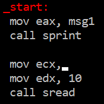{#fig:012 width=70%}

При трансляции появилась ошибка, но, тем не менее, оба файла были созданы.

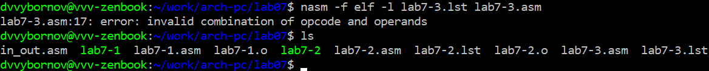{#fig:013 width=100%}

Также сообщение об ошибке было добавлено и в файл листинга.

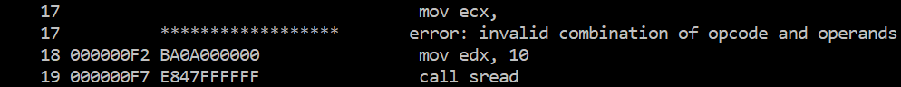{#fig:014 width=70%}

## Задание для самостоятельной работы.
### №1

Создаю новый файл и ввожу в него текст программы, находящей наименьшее из чисел 41, 35 и 62.

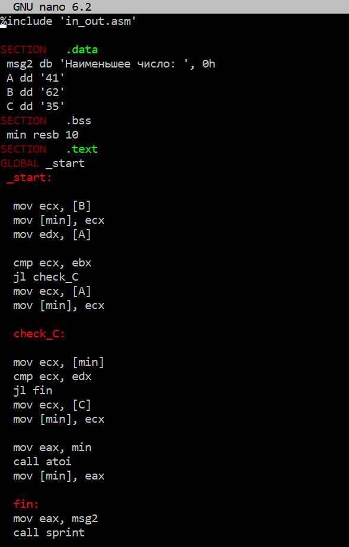{#fig:015 width=70%}

Проверяю работу программы.

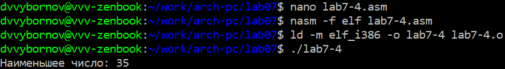{#fig:016 width=100%}

### №2

Создаю новый файл и ввожу в него текст программы, вычисляющей значение 10 варианта функции.

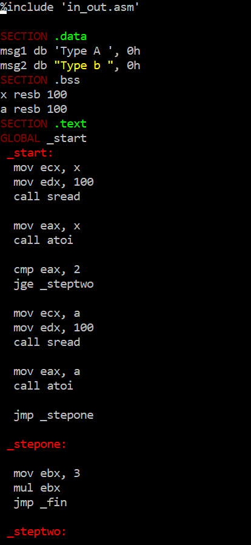{#fig:017 width=70%}

Проверяю работу программы со значениями a и x, равными 3, 0 и 1, 2.

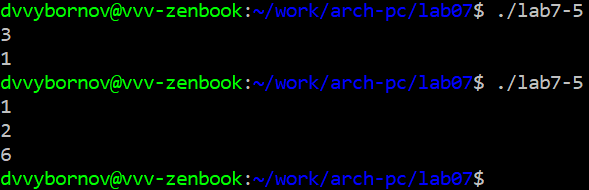{#fig:018 width=100%}

# Выводы

Выполнив эту лабораторную работу, я изученил команды условного и безусловного переходов, приобрёл навыки написания
программ с использованием переходов и познакомился с назначением и структурой файла листинга.
