---
## Front matter
title: "Лабораторная работа №8"
subtitle: "НКАбд-02-23"
author: "Выборнов Дмитрий Валерьевич"

## Generic otions
lang: ru-RU
toc-title: "Содержание"

## Bibliography
bibliography: bib/cite.bib
csl: pandoc/csl/gost-r-7-0-5-2008-numeric.csl

## Pdf output format
toc: false # Table of contents
toc-depth: 2
lof: false # List of figures
lot: false # List of tables
fontsize: 12pt
linestretch: 1.5
papersize: a4
documentclass: scrreprt
## I18n polyglossia
polyglossia-lang:
  name: russian
  options:
	- spelling=modern
	- babelshorthands=true
polyglossia-otherlangs:
  name: english
## I18n babel
babel-lang: russian
babel-otherlangs: english
## Fonts
mainfont: PT Serif
romanfont: PT Serif
sansfont: PT Sans
monofont: PT Mono
mainfontoptions: Ligatures=TeX
romanfontoptions: Ligatures=TeX
sansfontoptions: Ligatures=TeX,Scale=MatchLowercase
monofontoptions: Scale=MatchLowercase,Scale=0.9
## Biblatex
biblatex: true
biblio-style: "gost-numeric"
biblatexoptions:
  - parentracker=true
  - backend=biber
  - hyperref=auto
  - language=auto
  - autolang=other*
  - citestyle=gost-numeric
## Pandoc-crossref LaTeX customization
figureTitle: "Рис."
tableTitle: "Таблица"
listingTitle: "Листинг"
lofTitle: "Список иллюстраций"
lotTitle: "Список таблиц"
lolTitle: "Листинги"
## Misc options
indent: true
header-includes:
  - \usepackage{indentfirst}
  - \usepackage{float} # keep figures where there are in the text
  - \floatplacement{figure}{H} # keep figures where there are in the text
---

# Цель работы

Приобретение навыков написания программ с использованием циклов и обработкой
аргументов командной строки NASM.

# Задание

1. Реализация циклов в NASM.
2. Обработка аргументов командной строки.
3. Задание для самостоятельной работы.

# Теоретическое введение

Стек — это структура данных, организованная по принципу LIFO («Last In — First Out»
или «последним пришёл — первым ушёл»). Стек является частью архитектуры процессора и
реализован на аппаратном уровне. Для работы со стеком в процессоре есть специальные
регистры (ss, bp, sp) и команды.
Основной функцией стека является функция сохранения адресов возврата и передачи
аргументов при вызове процедур. Кроме того, в нём выделяется память для локальных
переменных и могут временно храниться значения регистров.
Стек имеет вершину, адрес последнего добавленного элемента, который хранится в регистре esp (указатель стека). Противоположный конец стека называется дном. Значение,
помещённое в стек последним, извлекается первым.
Команда push размещает значение в стеке, т.е. помещает значение в ячейку памяти, на
которую указывает регистр esp, после этого значение регистра esp увеличивается на 4.
Данная команда имеет один операнд — значение, которое необходимо поместить в стек.
Команда pop извлекает значение из стека, т.е. извлекает значение из ячейки памяти, на
которую указывает регистр esp, после этого уменьшает значение регистра esp на 4. У этой
команды также один операнд, который может быть регистром или переменной в памяти.
Для организации циклов существуют специальные инструкции. Для всех инструкций
максимальное количество проходов задаётся в регистре ecx. Наиболее простой является инструкция loop. Она выполняется в два этапа. Сначала из регистра ecx вычитается единица и
его значение сравнивается с нулём. Если регистр не равен нулю, то выполняется переход к
указанной метке. Иначе переход не выполняется и управление передаётся команде, которая
следует сразу после команды loop.

# Выполнение лабораторной работы

## Реализация циклов в NASM.

Создаю каталоги и файлы для новой лабораторной работы.

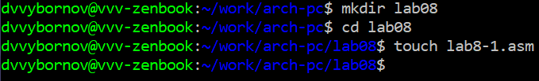{#fig:001 width=100%}

Ввожу в файл текст первой программы.

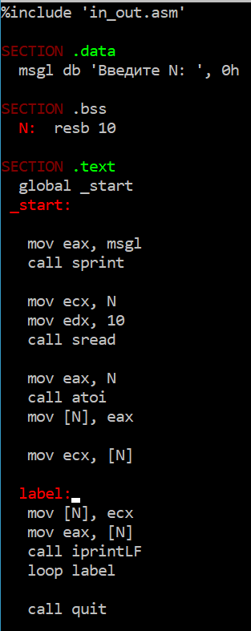{#fig:002 width=50%}

Создаю исполняемый файл и запускаю его.

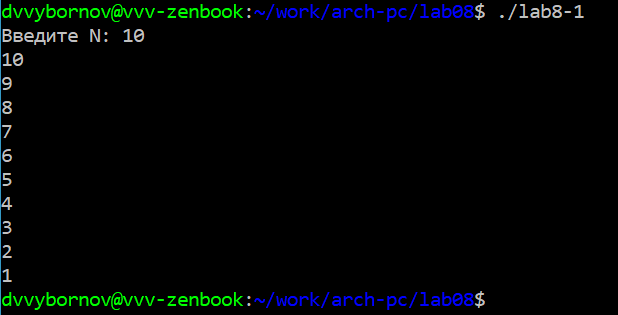{#fig:003 width=80%}

Добавляю в программу изменение значения регистра ecx в цикле.

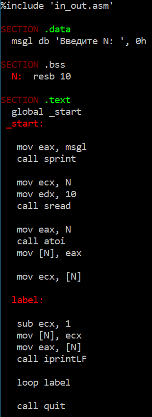{#fig:004 width=50%}

Запускаю изменённую программу.

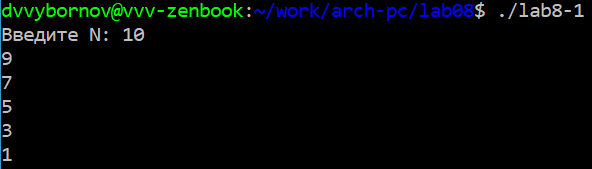{#fig:005 width=100%}

В данном случае число проходов цикла не соответствует значению N, так как за один проход значение регистра ecx уменьшается на 2.

Добавляю в текст программы комманды push и pop.

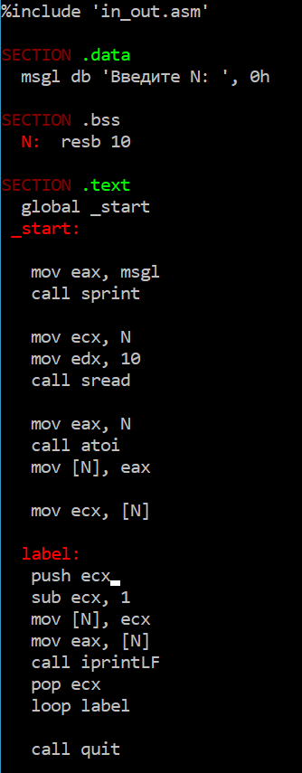{#fig:006 width=60%}

Зарускаю изменённую программу.

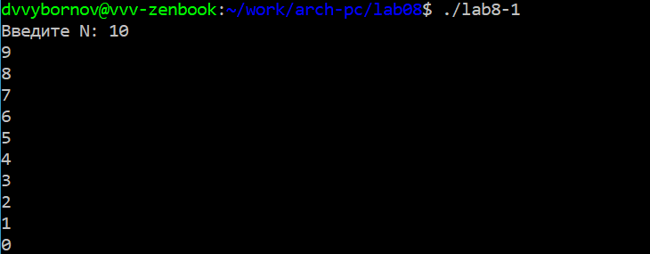{#fig:007 width=100%}

Число проходов соответствует значению N, но теперь вместо "10" выводится "0".

## Реализация циклов в NASM.

Создаю новый файл и ввожу в него текст второй программы.

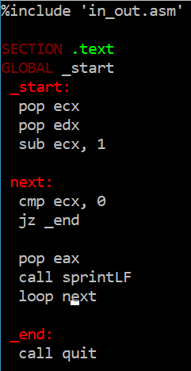{#fig:008 width=50%}

Запускаю программу с указанными аргументами.

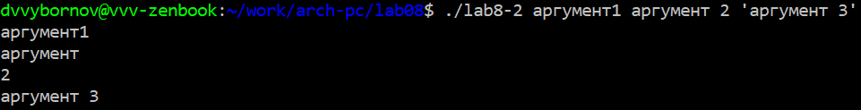{#fig:009 width=100%}

Программа обработала 4 аргумента, так как 'аргумент' и '2' разделились.

Создаю новый файл и ввожу в него текст третьей программы.

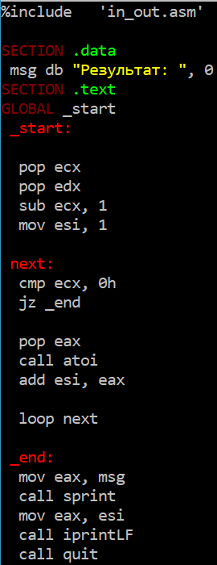{#fig:010 width=60%}

Создаю машинный файл и запускаю его.

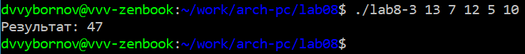{#fig:011 width=100%}

Изменяю программу так, чтобы она выводила произведение аргументов.

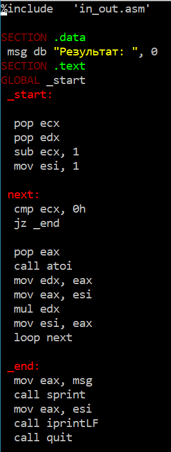{#fig:012 width=60%}

Создаю исполняемый файл и запускаю его.

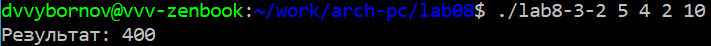{#fig:013 width=100%}

## Задание для самостоятельной работы.

Создаю программу, которая находит сумму значений функции 5(2 + x).

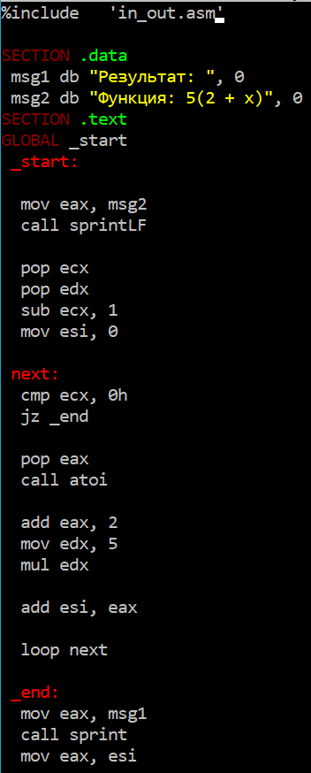{#fig:014 width=50%}

Проверяю работу программы с несколькими наборами аргументов.

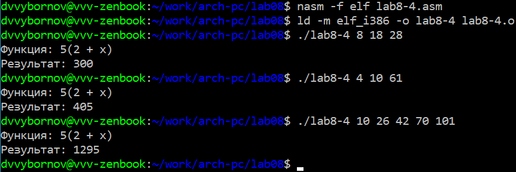{#fig:015 width=100%}

# Выводы

Завершив эту лабораторную работу, я приобрёл навыки написания программ с использованием циклов и обработкой аргументов командной строки NASM.
