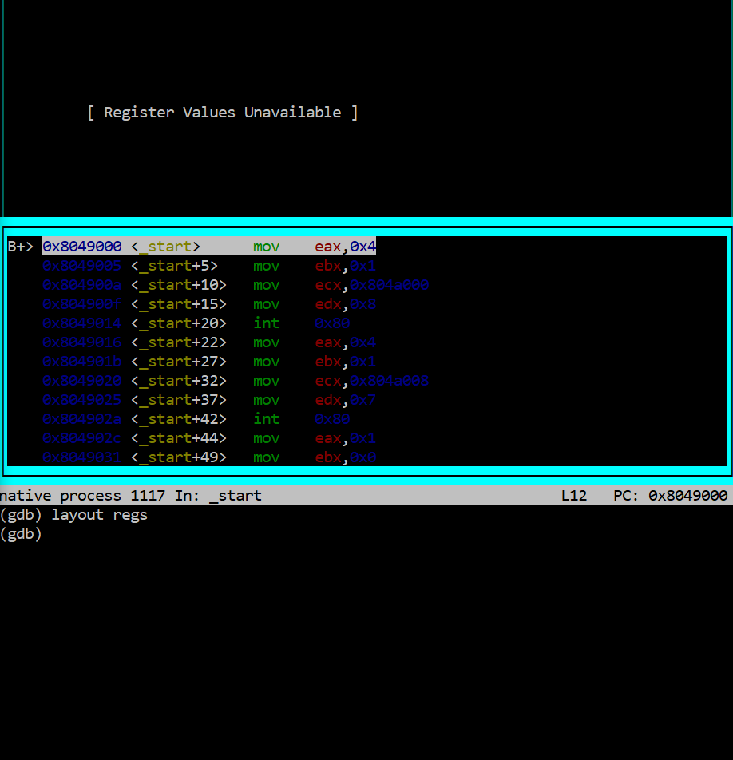

---
## Front matter
title: "Лабораторная работа №9"
subtitle: "НКАбд-02-23"
author: "Выборнов Дмитрий Валерьевич"

## Generic otions
lang: ru-RU
toc-title: "Содержание"

## Bibliography
bibliography: bib/cite.bib
csl: pandoc/csl/gost-r-7-0-5-2008-numeric.csl

## Pdf output format
toc: false # Table of contents
toc-depth: 2
lof: false # List of figures
lot: false # List of tables
fontsize: 12pt
linestretch: 1.5
papersize: a4
documentclass: scrreprt
## I18n polyglossia
polyglossia-lang:
  name: russian
  options:
	- spelling=modern
	- babelshorthands=true
polyglossia-otherlangs:
  name: english
## I18n babel
babel-lang: russian
babel-otherlangs: english
## Fonts
mainfont: PT Serif
romanfont: PT Serif
sansfont: PT Sans
monofont: PT Mono
mainfontoptions: Ligatures=TeX
romanfontoptions: Ligatures=TeX
sansfontoptions: Ligatures=TeX,Scale=MatchLowercase
monofontoptions: Scale=MatchLowercase,Scale=0.9
## Biblatex
biblatex: true
biblio-style: "gost-numeric"
biblatexoptions:
  - parentracker=true
  - backend=biber
  - hyperref=auto
  - language=auto
  - autolang=other*
  - citestyle=gost-numeric
## Pandoc-crossref LaTeX customization
figureTitle: "Рис."
tableTitle: "Таблица"
listingTitle: "Листинг"
lofTitle: "Список иллюстраций"
lotTitle: "Список таблиц"
lolTitle: "Листинги"
## Misc options
indent: true
header-includes:
  - \usepackage{indentfirst}
  - \usepackage{float} # keep figures where there are in the text
  - \floatplacement{figure}{H} # keep figures where there are in the text
---

# Цель работы

Приобретение навыков написания программ с использованием подпрограмм. Знакомство
с методами отладки при помощи GDB и его основными возможностями.

# Задание

1. Реализация подпрограмм в NASM.
2. Отладка программам с помощью GDB.
3. Добавление точек останова.
4. Обработка аргументов командной строки в GDB.
5. Задание для самостоятельной работы.

# Теоретическое введение

## Отладка.

Отладка — это процесс поиска и исправления ошибок в программе. В общем случае его
можно разделить на четыре этапа:
• обнаружение ошибки;
• поиск её местонахождения;
• определение причины ошибки;
• исправление ошибки.

Наиболее часто применяют следующие методы отладки:
• создание точек контроля значений на входе и выходе участка программы (например,
вывод промежуточных значений на экран — так называемые диагностические сообщения);
• использование специальных программ-отладчиков.
Отладчики позволяют управлять ходом выполнения программы, контролировать и изменять данные. Это помогает быстрее найти место ошибки в программе и ускорить её
исправление. Наиболее популярные способы работы с отладчиком — это использование
точек останова и выполнение программы по шагам.

Пошаговое выполнение — это выполнение программы с остановкой после каждой строчки,
чтобы программист мог проверить значения переменных и выполнить другие действия.
Точки останова — это специально отмеченные места в программе, в которых программаотладчик приостанавливает выполнение программы и ждёт команд.

GDB (GNU Debugger — отладчик проекта GNU) работает на многих UNIX-подобных
системах и умеет производить отладку многих языков программирования. GDB предлагает
обширные средства для слежения и контроля за выполнением компьютерных программ. Отладчик не содержит собственного графического пользовательского интерфейса и использует
стандартный текстовый интерфейс консоли. Однако для GDB существует несколько сторонних графических надстроек, а кроме того, некоторые интегрированные среды разработки
используют его в качестве базовой подсистемы отладки.
Отладчик GDB (как и любой другой отладчик) позволяет увидеть, что происходит «внутри»
программы в момент её выполнения или что делает программа в момент сбоя.

## Подпрограммы.

Подпрограмма — это, как правило, функционально законченный участок кода, который
можно многократно вызывать из разных мест программы. В отличие от простых переходов
из подпрограмм существует возврат на команду, следующую за вызовом.
Если в программе встречается одинаковый участок кода, его можно оформить в виде
подпрограммы, а во всех нужных местах поставить её вызов. При этом подпрограмма будет содержаться в коде в одном экземпляре, что позволит уменьшить размер кода всей
программы.

Для вызова подпрограммы из основной программы используется инструкция call, которая заносит адрес следующей инструкции в стек и загружает в регистр eip адрес соответствующей подпрограммы, осуществляя таким образом переход. Затем начинается выполнение
подпрограммы, которая, в свою очередь, также может содержать подпрограммы.
Подпрограмма завершается инструкцией ret, которая извлекает из стека адрес, занесённый туда соответствующей инструкцией call, и заносит его в eip. После этого выполнение
основной программы возобновится с инструкции, следующей за инструкцией call.

Подпрограмма может вызываться как из внешнего файла, так и быть частью основной
программы.

# Выполнение лабораторной работы

## Реализация подпрограмм в NASM.

Создаю новый файл и ввожу в него текст программы.

{#fig:001 width=40%}

Создаю исполняемый файл и проверяю его работу.

{#fig:002 width=80%}

Изменяю текст программы.

{#fig:003 width=40%}

Запускаю изменённую программу и проверяю её работу.

{#fig:004 width=80%}

## Отладка программам с помощью GDB.

Создаю новый файл и ввожу в него текст программы вывода Hello, world!

{#fig:005 width=40%}

Получаю исполняемый файл, загружаю его в GDB и проверяю его при помощи команды run.

{#fig:006 width=90%}

Запускаю прогамму с брейкпоинтом.

{#fig:007 width=60%}

Изучаю диссимилированный код программы с двумя разными синтаксисами.

{#fig:008 width=40%}

Основные  различия отображения синтаксиса машинных команд в режимах ATT и Intel заключаются в отображении третьего столбца данных.

Включаю режим псевдографики.

{#fig:009 width=90%}

## Добавление точек останова.

Создаю ещё одну точку останова и проверяю информацию о них.

{#fig:010 width=90%}

##  Работа с данными программы в GDB.

Во время работы программы изменяются значения тех регистров, с которыми она взаимодействует, а также значение регистра eip.

Проверяю информацию о регистрах.

{#fig:011 width=90%}

Просматриваю значение регистров msg1 и msg2.

{#fig:012 width=60%}

Изменяю несколько символов в msg1 и msg2.

{#fig:013 width=60%}

Вывожу значение регистра eax в разных форматах.

{#fig:014 width=30%}

Изменяю значение регистра ebx.

{#fig:015 width=30%}

В первый раз изменение не сработало, так как в ebx хранилось численное значение.

## Обработка аргументов командной строки в GDB.

Копирую нужный файл из восьмой лабораторной работы, создаю исполняемый файл и загружаю его в GDB.

{#fig:016 width=90%}

Запускаю программу.

{#fig:017 width=90%}

Просматриваю остальные позиции стека.

{#fig:018 width=80%}

Шаг изменения адреса равен 4, так как для каждого обьекта в стеке отводится 4 бита.

## Задание для самостоятельной работы.

### №1

Преобразовываю программу из восьмой лабораторной работы.

{#fig:019 width=40%}

Проверяю работу изменённой программы.

{#fig:020 width=100%}

### №2

Копирую текст нужной программы в новый файл.

{#fig:021 width=40%}

Запускаю эту программу при помощи GDB.

{#fig:022 width=100%}

Все проблемы этой программы связаны с тем, как в ней использованы регистры. 

Исправляю текст программы.

{#fig:023 width=40%}

Проверяю работу программы.

{#fig:024 width=100%}

Теперь прогдамма даёт правильный результат.

# Выводы

Выполнив эту лабораторную работу, я приобрёл навыки написания программ с использованием подпрограмм и познакомился
с методами отладки при помощи GDB и его основными возможностями.
