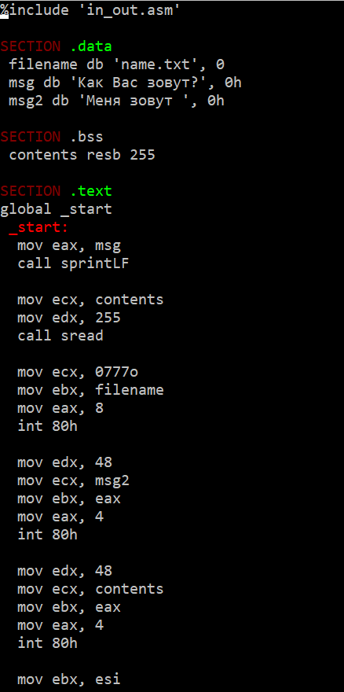

---
## Front matter
title: "Лабораторная работа №10"
subtitle: "НКАбд-02-23"
author: "Выборнов Дмитрий Валерьевич"

## Generic otions
lang: ru-RU
toc-title: "Содержание"

## Bibliography
bibliography: bib/cite.bib
csl: pandoc/csl/gost-r-7-0-5-2008-numeric.csl

## Pdf output format
toc: false # Table of contents
toc-depth: 2
lof: false # List of figures
lot: false # List of tables
fontsize: 12pt
linestretch: 1.5
papersize: a4
documentclass: scrreprt
## I18n polyglossia
polyglossia-lang:
  name: russian
  options:
	- spelling=modern
	- babelshorthands=true
polyglossia-otherlangs:
  name: english
## I18n babel
babel-lang: russian
babel-otherlangs: english
## Fonts
mainfont: PT Serif
romanfont: PT Serif
sansfont: PT Sans
monofont: PT Mono
mainfontoptions: Ligatures=TeX
romanfontoptions: Ligatures=TeX
sansfontoptions: Ligatures=TeX,Scale=MatchLowercase
monofontoptions: Scale=MatchLowercase,Scale=0.9
## Biblatex
biblatex: true
biblio-style: "gost-numeric"
biblatexoptions:
  - parentracker=true
  - backend=biber
  - hyperref=auto
  - language=auto
  - autolang=other*
  - citestyle=gost-numeric
## Pandoc-crossref LaTeX customization
figureTitle: "Рис."
tableTitle: "Таблица"
listingTitle: "Листинг"
lofTitle: "Список иллюстраций"
lotTitle: "Список таблиц"
lolTitle: "Листинги"
## Misc options
indent: true
header-includes:
  - \usepackage{indentfirst}
  - \usepackage{float} # keep figures where there are in the text
  - \floatplacement{figure}{H} # keep figures where there are in the text
---

# Цель работы

Приобретение навыков написания программ для работы с файлами.

# Задание

1. Основная часть лабораторной работы.
2. Задание для самостоятеольной работы.

# Теоретическое введение

ОС GNU/Linux является многопользовательской операционной системой. И для обеспечения защиты данных одного пользователя от действий других пользователей существуют
специальные механизмы разграничения доступа к файлам. Кроме ограничения доступа, данный механизм позволяет разрешить другим пользователям доступ данным для совместной
работы.
Права доступа определяют набор действий (чтение, запись, выполнение), разрешённых
для выполнения пользователям системы над файлами. Для каждого файла пользователь
может входить в одну из трех групп: владелец, член группы владельца, все остальные. Для
каждой из этих групп может быть установлен свой набор прав доступа.
В операционной системе Linux существуют различные методы управления файлами, например, такие как создание и открытие файла, только для чтения или для чтения и записи,
добавления в существующий файл, закрытия и удаления файла, предоставление прав доступа.
Обработка файлов в операционной системе Linux осуществляется за счет использования
определенных системных вызовов.

# Выполнение лабораторной работы

## Основная часть лабораторной работы.

Создаю новый каталог и файлы readme-1.txt, readme-2.txt и lab10-1.asm.

{#fig:001 width=80%}

Ввожу текст нужной мне программы в файл lab10-1.asm.

{#fig:002 width=40%}

Создаю исполняемый файл и проверяю его работу.

{#fig:003 width=80%}

Изменяю права доступа к исполняемому файлу lab10-1.asm при помощи команды chmod.

{#fig:004 width=80%}

Программу невозможно запустить, так как теперь у меня нет прав на исполнение.

Добавляю файлу с исходным кодом права на исполнение и пытаюсь его запустить. Этот файл не является исполняемым, из - за чего после запуска каждая строка выдаёт ошибку.

{#fig:005 width=80%}

Изменяю права доступа к файлам readme-1.txt и readme-2.txt в соответствии с таблицей.

{#fig:006 width=80%}

## Задание для самостоятельной работы.

Создаю новый файл и ввожу в него текст программы, работающей по указанному алгоритму.

{#fig:007 width=40%}

Запускаю программу и проверяю её работу, после чего проверяю наличие файла name.txt и его содержимое.

{#fig:008 width=100%}

# Выводы

Выполнив эту лабораторную работу, я приобрёл навыки написания программ для работы с файлами.
